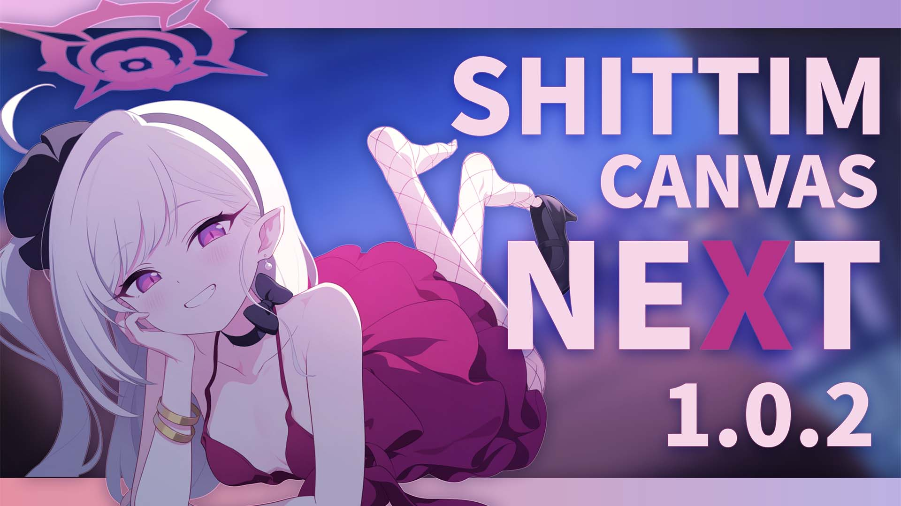
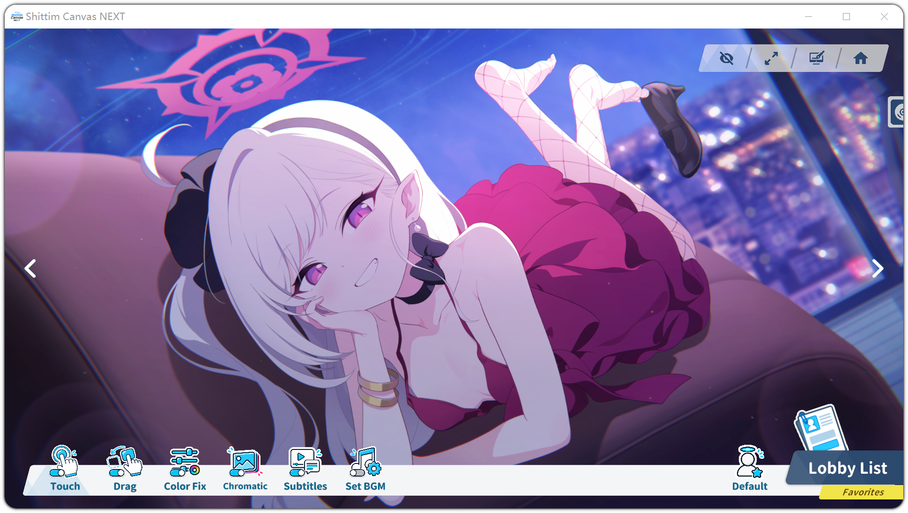

# Shittim Canvas NEXT

## 1. 简介

- **Shittim Canvas NEXT** 是一款基于 **Unity** 开发的展示型工具软件，可以用作操作系统的 **桌面壁纸**，专注于还原《蔚蓝档案》中的平面动态场景内容，包括 **记忆大厅**、**剧情动态背景** 等资源的播放与展示效果。

- 项目的目标是完美复刻游戏内表现，复现原作中的视觉呈现、动画逻辑与交互细节，并在此基础上提供更高的可扩展性与自定义能力。

- Shittim Canvas NEXT 本体仓库目前为私有仓库，这个仓库是用于收集问题以及建议的，访问[官方网站](https://sc.japerz.com/)以了解更多。

## 2. 特性

- ### 高还原度
  - 还原游戏内记忆大厅与剧情动态背景的整体视觉效果
  - 还原粒子特效、后期处理等视觉层面的表现
  - 还原游戏内播放动画的混合参数与完整逻辑等
  - 还原游戏内响应用户交互的完整逻辑
  - 还原场景的环境音与开场音效等音频层面的表现

- ### 高自定义程度
  - 计划支持导入并自定义 **Spine 4.2** 版本的记忆大厅资源
  - 计划扩展更多非官方的自定义功能
  - 计划支持扩展官方记忆大厅原有的交互形式
  - 计划支持可自定义的交互区域

## 3. 开发者

<table>
  <tr>
    <td align="center">
      <a href="https://github.com/SparseShadow2024">
        
         
        <b>Sparse Shadow</b>
      </a>
       
      🔧 主要开发者
    </td>
    <td align="center">
      <a href="https://github.com/Japerz12138">
        
         
        <b>Japerz</b>
      </a>
       
      🎨 UI 设计
    </td>
  </tr>
</table>

## 4. 社群

## 5. 相关链接

| 类型 | 链接 |
| --- | --- |
| 官方网站 | https://sc.japerz.com |
| 官方文档 | https://sc-docs.japerz.com |
| SCNX 公开仓库 | https://github.com/Game-Dev-Dep/Shittim_Canvas_NEXT_Public |
| SCNX 角色元数据仓库 | https://github.com/Game-Dev-Dep/Shittim_Canvas_NEXT_Metadata |
| SCNX 知识库仓库 | https://github.com/Game-Dev-Dep/Shittim_Canvas_NEXT_Knowledge_Base |
| 软件问题反馈腾讯文档 | https://docs.qq.com/sheet/DRXdDTFFvSFhvbU5M |
| 软件意见反馈腾讯文档 | https://docs.qq.com/sheet/DRVdIZXNwdnVNWGpL |
| 角色问题反馈腾讯文档 | https://docs.qq.com/sheet/DRUVITWVIWG9EcHF5 |
